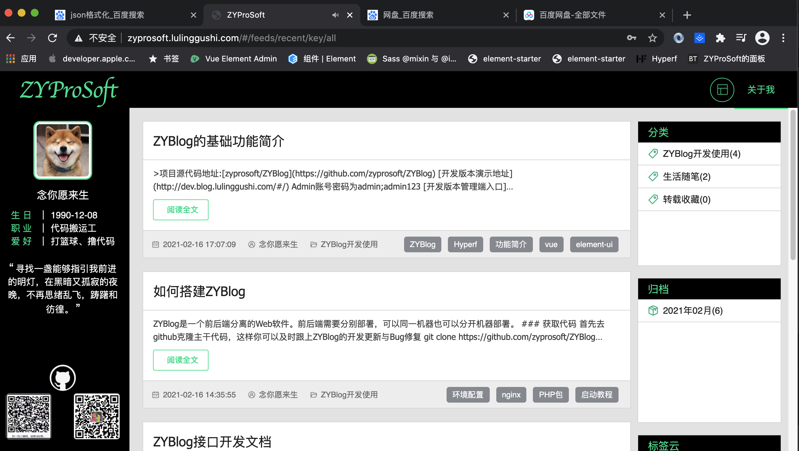
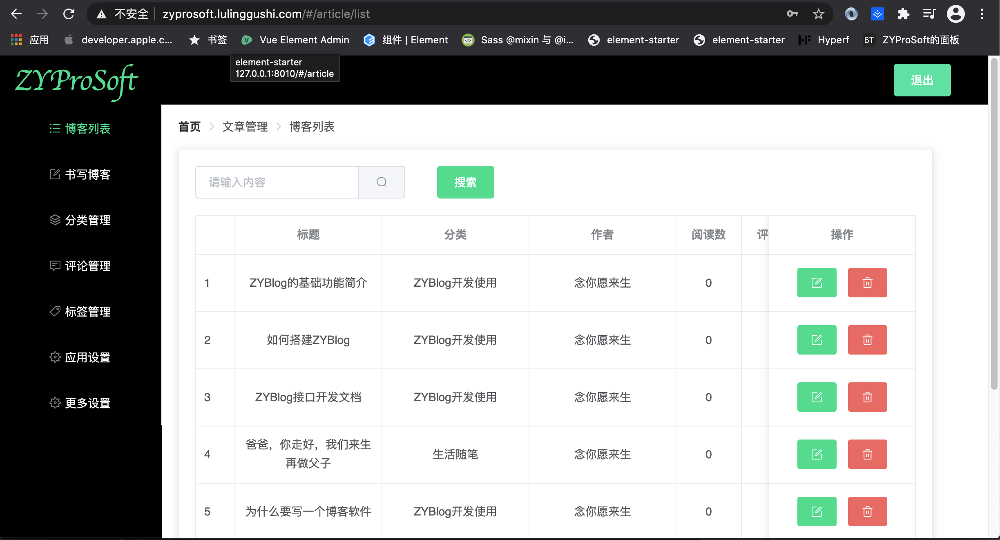

#### ZYBlog是一款后台程序员自学前端开发出来的简易博客系统。

#### 效果如下:

#### 正式环境-ZYProSoft的个人博客
http://zyprosoft.lulinggushi.com

#### 开发体验环境
http://dev.blog.lulinggushi.com
账号:admin
密码:admin123(请勿修改)

#### 博客包含功能及技术结构
1. 博客文章管理，包括增加、更新、删除等
2. 文章评论管理，包含增加、更新、删除、快捷回复等
3. 简易的分栏管理，可以自定义创建分栏
4. 简易的标签管理，每篇文章可以有最多五个标签
5. 博主个性化信息设置，可以设置个人的头像，QQ扫码二维码，微信扫码二维码，github主页等信息
更多介绍: http://zyprosoft.lulinggushi.com/#/article/15

#### 博客搭建教程
http://zyprosoft.lulinggushi.com/#/article/14

#### 博客不同端开发接口文档
http://zyprosoft.lulinggushi.com/#/article/13

